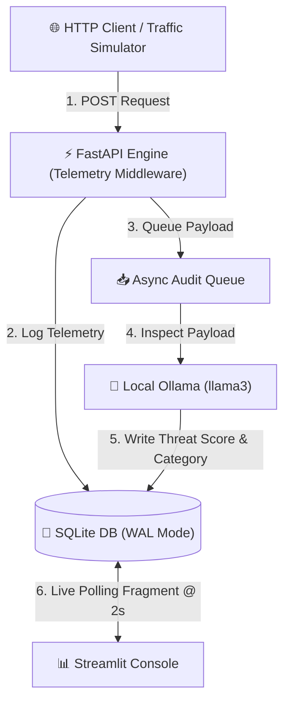

```markdown
# Rate Shield 🛡️

Rate Shield is a real-time security telemetry engine and dashboard designed to inspect inbound HTTP payload queries, evaluate threat vectors using a local LLM (`llama3` via Ollama), and visualize network metrics in a Streamlit console.

## System Architecture



## Features

* **Non-Blocking Telemetry Ingestion**: Custom ASGI middleware records HTTP status codes, latencies, and client IP addresses.
* **Asynchronous LLM Security Auditing**: Decoupled background queue passes incoming payload samples to a local `llama3` instance via `ollama.AsyncClient`.
* **Deterministic Action Enforcer**: Categorizes threat levels strictly into `ALLOW`, `SANITIZE`, or `BLOCK` actions based on normalized score ranges.
* **SQLite Concurrency**: Configured with Write-Ahead Logging (`WAL`) mode and busy timeout handling to allow simultaneous high-frequency writes and real-time polling.
* **Live Streamlit Console**: Features real-time metric counters, latency distribution histograms, scatter plot risk spectrums, and threat category donut charts.

## Directory Structure

```text
rate_shield/
├── app/
│   ├── __init__.py
│   ├── config.py
│   ├── database.py
│   ├── middleware.py
│   ├── schemas.py
│   └── worker.py
├── dashboard/
│   └── app.py
├── data/
│   └── telemetry.py
├── .gitignore
├── main.py
├── README.md
└── requirements.txt

```

## Getting Started

### Prerequisites

1. Install Python 3.10+
2. Install and launch [Ollama](https://ollama.com/)
3. Pull the `llama3` model:
```bash
ollama pull llama3

```


### Setup

1. Clone the repository:
```bash
git clone [https://github.com/rutush2/rate_shield.git](https://github.com/rutush2/rate_shield.git)
cd rate_shield

```


2. Create and activate a virtual environment:
```bash
python -m venv venv
source venv/bin/activate  # On Windows: venv\Scripts\activate

```


3. Install dependencies:
```bash
pip install -r requirements.txt

```


### Execution

1. Start the FastAPI backend:
```bash
uvicorn main:app --reload

```


2. Start the Streamlit dashboard in a separate terminal:
```bash
streamlit run dashboard/app.py

```


3. Open `http://localhost:8501` to view the console and use the sidebar traffic simulator to send test attack batches.

```

